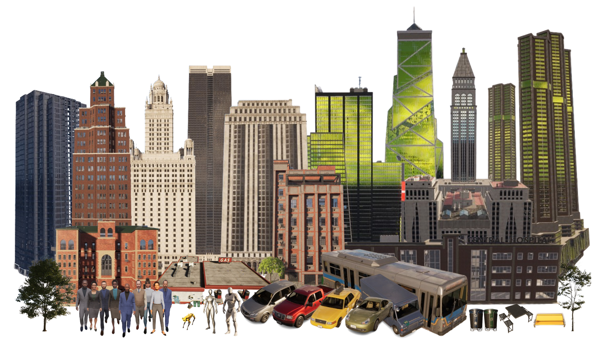
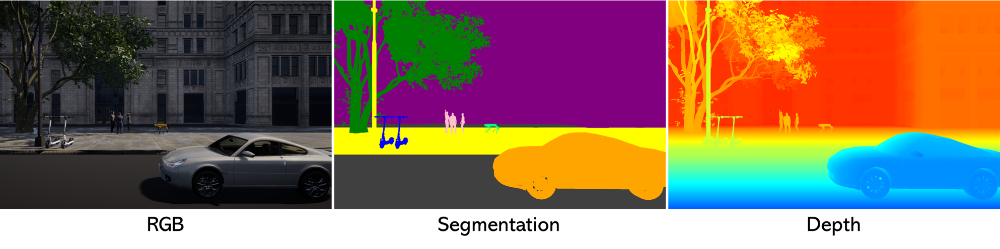

Unreal Engine Backend
=====================

The Unreal Engine backend forms the foundation of SimWorld, providing high-fidelity rendering and physics simulation.

Various Scenes
--------------

.. image:: ../assets/scenes.png
   :width: 800px
   :align: center
   :alt: A Subset of Collected Scenes

SimWorld supports two scene-building modes: procedural generation and pre-built scenes.

The procedural generation module enables the creation of virtually unlimited city layouts populated with diverse buildings, roads, and street elements. This allows users to dynamically render coherent and realistic urban environments at runtime, making it ideal for large-scale experimentation under customizable conditions. See :doc:`Procedural City Generation <../components/citygen>` for details.

In addition to procedurally generated cities, SimWorld also provides a rich collection of pre-built maps (see :doc:`Additional Environments <../getting_started/additional_environments>`). These manually designed scenes can be created by users or imported from external sources such as the Unreal Engine Marketplace. The current release includes 102 curated scenes spanning a wide range of visual and structural styles—such as ancient towns, natural landscapes, futuristic cities, and fictional worlds. Each map offers distinct visual cues, spatial layouts, and interaction dynamics, enabling diverse and comprehensive evaluation of embodied agents.

Assets
------

Our simulator provides a rich collection of city-scale assets, designed to support realistic and diverse urban simulations. These assets include buildings, trees, street furniture, vehicles, pedestrians, and robots. All assets are sourced from the Unreal Engine Marketplace to ensure high visual fidelity and performance.

In addition to the curated asset library, we also offer an **Asset Generation Pipeline** that enables users to create ``.uasset`` files directly from natural language descriptions. This tool streamlines the content creation process by converting user prompts into usable Unreal Engine assets, significantly lowering the barrier for customizing city environments.

Collected Assets
~~~~~~~~~~~~~~~~

Below is a selection of the assets currently available in our simulator:

* **Buildings**: A variety of architectural styles, including residential, commercial, and industrial structures.
* **Trees**: Multiple tree species with seasonal variations to enhance environmental realism.
* **Street Furniture**: Items such as benches, streetlights, boxes, and trash bins to add detail and immersion.
* **Vehicles**: A range of vehicles including cars, buses, trucks, and scooters, each with accurate scale and animations.
* **Pedestrians**: Human characters with diverse appearances and animations to simulate crowd behavior.
* **Robots**: The detailed introduction of the robot can be found in :doc:`SimWorld-Robotics <../simworld-robotics/simworld_robotics>`.

These assets collectively enable the creation of complex, dynamic, and realistic city scenes for simulation, visualization, and research purposes.

.. _ue_detail-sensors:

Sensors
-------

As illustrated in the figure above, SimWorld supports a variety of sensors, including RGB images, segmentation maps, and depth images, enabling a rich understanding of the surrounding environment.

How to get images
~~~~~~~~~~~~~~~~~

.. code-block:: python

   # viewmode can be 'lit', 'depth' and 'object_mask'
   image = communicator.get_camera_observation(camera_id, viewmode)  # Get camera image observation

   # adjust camera
   ucv.get_cameras()                                   # Get list of all available cameras
   ucv.get_camera_location(camera_id)                  # Get camera position (x, y, z)
   ucv.get_camera_rotation(camera_id)                  # Get camera rotation (pitch, yaw, roll)
   ucv.get_camera_fov(camera_id)                       # Get camera field of view
   ucv.get_camera_resolution(camera_id)                # Get camera resolution (width, height)
   ucv.set_camera_location(camera_id, location)        # Set camera position (location: tuple of x, y, z)
   ucv.set_camera_rotation(camera_id, rotation)        # Set camera rotation (rotation: tuple of pitch, yaw, roll)
   ucv.set_camera_fov(camera_id, fov)                  # Set camera field of view (fov: float)
   ucv.set_camera_resolution(camera_id, resolution)    # Set camera resolution (resolution: tuple of width, height)

**Related files:** ``communicator.py``, ``unrealcv.py``.

Panoramic video export
~~~~~~~~~~~~~~~~~~~~~~

``simworld.utils.panorama`` exports six synchronized square camera views as
a 2:1 equirectangular projection (ERP) MP4. It covers 360 degrees horizontally
and 180 degrees vertically. A single perspective recording, even at a 2:1
resolution, does not contain the views needed to produce a full panorama.

Each input frame is a dictionary of six BGR ``uint8`` images with equal
dimensions. All six views must use the same camera location, the same
simulation instant, a square resolution and a 90-degree horizontal FOV.
The face convention uses Unreal's +X forward, +Y right and +Z up axes:

.. list-table:: Camera rotations (pitch, yaw, roll), in degrees
   :header-rows: 1

   * - Face
     - Rotation
   * - ``front``
     - ``(0, 0, 0)``
   * - ``right``
     - ``(0, 90, 0)``
   * - ``back``
     - ``(0, 180, 0)``
   * - ``left``
     - ``(0, -90, 0)``
   * - ``up``
     - ``(90, 0, 0)``
   * - ``down``
     - ``(-90, 0, 0)``

These rotations are also available as ``CUBEMAP_ROTATIONS``. Capture all six
faces before advancing the simulation. With sequential camera reads, use
synchronous mode and verify that each captured image reflects the requested
camera pose in your UE build. Asynchronous captures can introduce moving-object
seams; projection cannot recover views missing from the input recordings.

For example, export existing recordings stored as
``recording/front/000000.png``, ``recording/right/000000.png``, etc.:

.. code-block:: python

   from pathlib import Path

   import cv2

   from simworld.utils.panorama import CUBEMAP_ROTATIONS, save_panorama_video

   recording = Path('recording')

   def cubemap_frames():
       for front_path in sorted((recording / 'front').glob('*.png')):
           yield {
               face: cv2.imread(str(recording / face / front_path.name))
               for face in CUBEMAP_ROTATIONS
           }

   save_panorama_video(
       cubemap_frames(), 'panorama.mp4', resolution=(1440, 720), fps=25,
   )

Frames are projected and written incrementally, so the whole recording does
not need to fit in memory. The output height must be even to avoid video-codec
cropping. ``fps`` controls playback speed, independently of capture throughput.
For a single image, use ``CubemapProjector(face_size, resolution).project(faces)``.
See :mod:`simworld.utils.panorama` for the API.

The MP4 contains ERP pixels using OpenCV's ``mp4v`` codec. It does not insert
spherical-video metadata; select equirectangular/360 mode in your player or
add the metadata required by your publishing platform. Export tests use
synthetic cubemaps and a real MP4 encode/decode round trip; UE capture and
player-specific metadata are separate integration steps.

Synchronous and Asynchronous mode
---------------------------------

Our simulator supports both synchronous and asynchronous execution modes for communication between the Python client and the Unreal Engine (UE) server.

In synchronous mode, the Python client explicitly controls the simulation timing. At each step, it sends a tick command to the UE server and waits until the server completes the simulation update. This mode ensures deterministic behavior, which is especially important for reinforcement learning, multi-agent coordination, and evaluation tasks.

In asynchronous mode, the UE server runs continuously at its own frame rate, while the Python client retrieves data at any time. This allows for real-time interaction but can lead to non-determinism and race conditions in agent-environment interaction.

.. code-block:: python

   # Set simulation mode: choose between "sync" (synchronous) and "async" (asynchronous)
   mode = "sync"
   tick_interval = 0.05  # Duration of each simulation step in seconds (only used in sync mode)
   ucv.set_mode(mode, tick_interval)

   # Advance the simulation by one tick (tick_interval seconds)
   ucv.tick()
